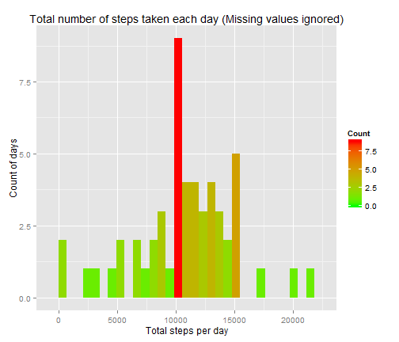
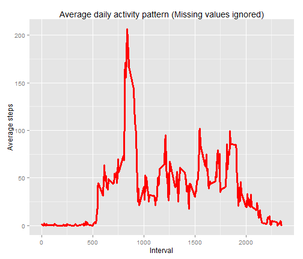
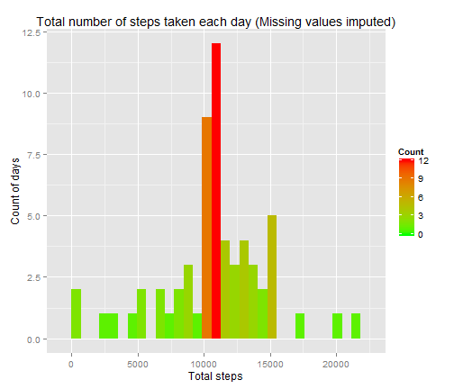

## Title: Personal activity monitoring device exploratory data analysis

### Introduction
Exploratory data analysis was performed on the data collected from a personal activity monitoring device. This device collects data at 5 minute intervals throughout the day. The data consists of two months of data from an anonymous individual collected during the months of October and November, 2012 and include the number of steps taken in 5 minute intervals each day [1].

### Data Collection
For our analysis we down loaded the "activity.csv" file from Coursera.org web site [1] on 3-June-2014 at 8:20 pm US ET.
The variables included in this dataset are:
 - steps: Number of steps taking in a 5-minute interval (missing values are coded as NA)
 - date: The date on which the measurement was taken in YYYY-MM-DD format
 - interval: Identifier for the 5-minute interval in which measurement was taken

### Data Analysis
During the data analysis phase five major tasks with several sub tasks were performed. The detail of these five tasks and their accompanying R code is shown here. 

**1.  Loading and preprocessing the data**

**1a.  Load the data**  
It is assumed that the "activity.csv" file is present in the working directory.  


```r
# Read the activity.csv file in a data frame
if (!file.exists("activity.csv")) {sprintf("No such file")}
if (file.exists("activity.csv")) {
    act <- read.table("activity.csv", sep=",", header = TRUE, stringsAsFactors=FALSE)

    # Number of rows and columns in the data set
    nRows <- dim(act)[1]
    nCols <- dim(act)[2]

    # Report the count of NA's in the activity data set
    naCount <- length(which(is.na(act) == TRUE))
}
```
There are 17568 records and 3 features in the data set with 2304 records containing misssing values (NA).  
Also note that the feature 'date' is of char type not a date type.  

**1b.  Process/transform the data into a format suitable for the analysis**  
Check the missing values in all three features and their type.  


```r
## 1. Data Transformation

# First examine the structure of the data
strt <- str(act)
```

```
## 'data.frame':	17568 obs. of  3 variables:
##  $ steps   : int  NA NA NA NA NA NA NA NA NA NA ...
##  $ date    : chr  "2012-10-01" "2012-10-01" "2012-10-01" "2012-10-01" ...
##  $ interval: int  0 5 10 15 20 25 30 35 40 45 ...
```

```r
# Convert the date column data into Date type 
act$date <- as.Date(act$date, format="%Y-%m-%d")
 
# Separate the complete data from the not complete data
act1 <- act[complete.cases(act),]
act2 <- act[!complete.cases(act),]
naCount1 <- dim(act1)[1]
naCount2 <- dim(act2)[1]
```
The feature 'date' is converted from chr (character) to date type, then a sub-set of activity data is created with no missing values i.e. all missing values ignored. The resulting sub-data set contains 15264 records with 3 features.  


**2. Total number of steps taken per day**  

**2a.  Histogram of the total number of steps taken each day**  
This histogram is produced using the data set 'act1' which contains no missing values.


```r
# Aggregate total number of steps taken each day
sumStepsDaily1 <- aggregate(act1$steps, by=list(act1$date), FUN=sum)
colnames(sumStepsDaily1) <- c("date", "stepsSum")

# Plot a histogram of "Total Number of Steps Taken Each Day"
library(ggplot2)
pHist1 <- ggplot(sumStepsDaily1, aes(x=stepsSum)) + geom_histogram() + 
          geom_histogram(aes(fill = ..count..)) +
          scale_fill_gradient("Count", low = "green", high = "red") +
          labs(title=("Total number of steps taken each day (Missing values ignored)")) +
          scale_y_continuous(name="Count of days") + 
          scale_x_continuous(name="Total steps per day")

suppressMessages(print(pHist1))
```

 

**2b. Mean and Median of total number of steps taken per day**  


```r
# Find mean and median total number of steps taken per day 
stepsMean1 <- mean(sumStepsDaily1$stepsSum)
stepsMedian1 <- median(sumStepsDaily1$stepsSum)
```
Mean of the total number of steps taken per day: 10766.19  
Median of the total number of steps taken per day: 10765  

**3. Average daily activity pattern**

**3a. Time series plot**  
This time series plot is produced by starting from the data set 'act1' which contains no missing values.


```r
# Mean of the steps taken for each interval averaged across all days
meanStepsDF1 <- aggregate(act1$steps, by=list(act1$interval), FUN=mean)
colnames(meanStepsDF1) <- c("interval", "stepsMean")

# 3a. Make a time series plot (i.e. type = "l") of the 5-minute interval 
# (x-axis) and the average number of steps taken, averaged across all days (y-axis)

require(ggplot2)
pLine <- ggplot(meanStepsDF1, aes(x = interval, y = stepsMean)) + 
          geom_line(colour = "red", size = 1.25) + labs(title=("Average daily activity pattern (Missing values ignored)")) + 
          scale_y_continuous(name="Average steps") + scale_x_continuous(name="Interval")

suppressMessages(print(pLine))
```

 

**3b. Maximum number of steps**   

```r
# 3b. Which 5-minute interval, on average across all the 
# days in the dataset, contains the maximum number of steps?
maxStepsMean1 <- meanStepsDF1[meanStepsDF1$stepsMean == max(meanStepsDF1$stepsMean),]
```
The five minute interval containing maximum number of steps: 835   
The maximum number of steps averaged across all days: 206.1698

**4. Imputing missing values**

**4a. Report missing values** 


```r
# 4a. Calculate and report the total number of missing values 
# in the dataset (i.e. the total number of rows with NAs)
naCount <- length(which(is.na(act) == TRUE))
```
Total number of missing values: 2304  

**4b. Strategy for filling missing values**  

As shown above in section 1b, the original data set "act" contains missing values but only in the "step" feature. These missing values are imputed here.
In order to fill the missing values in the "step"" feature of the original data set "act", use the mean of 5-minute interval on average across all the days. The mean five minute interval data set "meanStepsDF1" is created in section 3a above.  
Fill the missing value in the original data set 'act' using the data set "meanStepsDF1".   

**4c. Create data set with filled missing values**  


```r
# 4c. Create a new dataset that is equal to the original 
# dataset but with the missing data filled in.

for (i in 1:length(act$steps)) {
     if ( is.na(act$steps[i]) ) {
          act$steps[i] <- meanStepsDF1$stepsMean[meanStepsDF1$interval == act$interval[i]]
     }
}
```

**4d. Histogram of the total number of steps taken each day with filled values**


```r
# 4d. Make a histogram of the total number of steps taken each day and Calculate and report 
# the mean and median total number of steps taken per day. Do these values differ from 
# the estimates from the first part of the assignment? What is the impact of imputing 
# missing data on the estimates of the total daily number of steps?

# Total number of steps taken each day
sumStepsDaily <- aggregate(act$steps, by=list(act$date), FUN=sum)
colnames(sumStepsDaily) <- c("date", "stepsSum")

# Plot a histogram of "Total number of steps taken each day"
pHist2 <- ggplot(sumStepsDaily, aes(x=stepsSum)) + geom_histogram() + 
       geom_histogram(aes(fill = ..count..)) +
       scale_fill_gradient("Count", low = "green", high = "red") +
       labs(title=("Total number of steps taken each day (Missing values imputed)")) +
       scale_y_continuous(name="Count of days") + 
       scale_x_continuous(name="Total steps")

suppressMessages(print(pHist2))
```

 

```r
# Find mean and median of total number of steps taken per day 
stepsMean2 <- mean(sumStepsDaily$stepsSum)
stepsMedian2 <- median(sumStepsDaily$stepsSum)
```

Mean of total number of steps taken per day (filled data):  10766.19  
Median of total number of steps taken per day (filled data):  10766.19  

As reported previously in section 2b:  
Mean of total number of steps taken per day (missing values ignored):  10766.19  
Median of total number of steps taken per day (missing values ignored):  10765.00  

**5. Differences in activity patterns between weekdays and weekends**

**5a. Create new factor variable indicating weekday/weekend** 

```r
# For this part the weekdays() function may be of some help here. 
# Use the dataset with the filled-in missing values for this part.

# 5a. Create a new factor variable in the dataset with two levels - "weekday" and "weekend" 
# indicating whether a given date is a weekday or weekend day.

act$dayType <- as.factor(c("weekday", "weekend"))
for (i in 1:length(act$date)) {
     dy <- weekdays(act$date[i])
     if ( (dy == "Saturday") || (dy == "Sunday") ) {
        act$dayType[i] <- as.factor("weekend")
     }
     else {
        act$dayType[i] <- as.factor("weekday")
     }
}

# Mean of the steps taken for each interval averaged across all days
meanStepsDF2 <- aggregate(act$steps, by=list(act$interval, act$dayType), FUN=mean)
colnames(meanStepsDF2) <- c("interval", "dayType", "stepsMean")
```

**5b. Time series plots (week days and week ends)**

```r
# Make a time series plot (i.e. type = "l") of the 5-minute interval 
# separately for weekend and weekday.
 
library(lattice)
pXyplot <- xyplot(stepsMean ~ interval | dayType , data=meanStepsDF2, 
           type="l", layout = c(1,2), xlab = "Interval", ylab = "Number of steps")

print(pXyplot)
```

 


### References  
1.  Coursera.org  
https://class.coursera.org/repdata-003/human_grading/view/courses/972142/assessments/3/submissions


